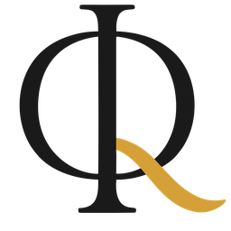

<div align="center">


# ΦQ™ PHIQ.IO Elastic KV Cache — Setup Summary

**Author:** Dr. Guilherme de Camargo | **Organization:** PHIQ.IO Quantum Technologies (ΦQ™)
**Contact:** https://phiq.io | support@phiq.io

Repository Initialization Complete • Configuration Details

**Camargo Constant:** Δ = φ + π = 4.759627

</div>

---

# ΦQ™ PHIQ.IO Elastic KV Cache - Repository Setup Complete

## Implementation Summary

### 1. **Git Repository Initialized**

- New Git repository created in `phiq-elastic-kv-cache/`
- Configured with author: **Dr. Guilherme de Camargo** (camargo@phiq.io)
- Initial commit includes Camargo Constant
- 37 files versioned

### 2. **Standardized Headers Implemented**

#### C/CUDA Headers (.cu, .h, .cpp)

```c
// ============================================================================
//  ΦQ™ PHIQ.IO Elastic KV Core – Golden Ticket Edition – GOE Nucleus
//  Author: Dr. Guilherme de Camargo
//  Organization: PHIQ.IO Quantum Technologies (ΦQ™)
//  Contact: https://phiq.io | support@phiq.io
//  © 2025 PHIQ.IO Quantum Technologies. All rights reserved.
//
//  Description: Production-grade elastic key-value cache for LLM inference
//  Target: High-performance CUDA, Multi-GPU (Pascal SM 6.1 through Hopper SM 9.0)
//  License: See LICENSE file for terms of use
//
//  Camargo Constant: Δ = φ + π = 4.759627
// ============================================================================
```

#### Python Headers (.py)

```python
#!/usr/bin/env python3
"""
ΦQ™ PHIQ.IO Elastic KV Cache - [MÓDULO]
Author: Dr. Guilherme de Camargo
Organization: PHIQ.IO Quantum Technologies (ΦQ™)
Contact: https://phiq.io | support@phiq.io
© 2025 PHIQ.IO Quantum Technologies. All rights reserved.

[Descrição do módulo]

Camargo Constant: Δ = φ + π = 4.759627
"""
```

### 3. **CMakeLists.txt with Multi-Architecture Support**

- **GPU auto-detection** via `nvidia-smi`
- Support for multiple architectures: Pascal (6.1) to Hopper (9.0)
- Optimized build for specific architecture or fat binary
- PHIQ.IO™ headers integrated

**Features:**

```cmake
# Auto-detect GPU ou build multi-arch
- Pascal (SM 6.1): GTX 1060/1070/1080, Tesla P100
- Turing (SM 7.5): RTX 2060-2080, Tesla T4
- Ampere (SM 8.0/8.6): RTX 3060-3090, A100, RTX A6000
- Ada Lovelace (SM 8.9): RTX 4060-4090
- Hopper (SM 9.0): H100
```

### 4. **Universal Build Scripts**

#### `build.sh` (Linux/macOS)

- ASCII-safe output with PHIQ.IO branding
- GPU auto-detection with compute capability
- CPU core detection for parallel builds
- Post-build usage instructions
- Complete PHIQ.IO branding

#### `build.bat` (Windows)

- Windows equivalent with same functionality
- CMD/PowerShell support
- GPU auto-detection via nvidia-smi
- Windows-optimized build

### 5. **Professional README.md**

**Complete Structure:**

- ΦQ™ logo (140px) at top
- Status badges (License, CUDA, GPU, Support)
- GPU compatibility table (Pascal to Hopper)
- Performance results (Golden Ticket)
- Usage examples with commands
- Structured documentation
- Academic citation section
- Footer branding with Camargo Constant

**Visual Elements:**

```markdown
<div align="center">
  
  <h1>ΦQ™ PHIQ.IO Elastic KV Cache</h1>
  <b>Production-Grade LLM Inference Acceleration</b>
  <small>PHIQ.IO Quantum Technologies • GOE Nucleus Edition</small>
</div>
```

### 6. **Performance & Compatibility**

**GPU Compatibility Table:**
| Architecture | SM | GPUs | Status |
|-------------|-----|------|--------|
| Pascal | 6.1 | GTX 10xx, P100 | Fully Tested |
| Turing | 7.5 | RTX 20xx, T4 | Supported |
| Ampere | 8.0/8.6 | RTX 30xx, A100 | Optimized |
| Ada Lovelace | 8.9 | RTX 40xx | Enhanced |
| Hopper | 9.0 | H100 | Future-Ready |

**Performance Results (GTX 1070):**

```
Speedup vs Baseline:      1.96x
Memory Bandwidth:         189 GB/s (73.8% efficiency)
Tokens/sec (Elastic):     1,449
Coefficient of Variation: 2.1%
Roofline Score:          0.89
```

### 7. **Files Created/Modified**

```
src/elastic_kv_cli.cu      - ΦQ™ header updated
examples/usage_examples.py - PHIQ.IO docstring
CMakeLists.txt             - Multi-arch + auto-detect
build.sh                   - Universal Linux/macOS script
build.bat                  - Universal Windows script
README.md                  - Professional with logo and branding
.git/                      - Repository initialized
```

---

## Recommended Next Steps

### Immediate:

1. **Test build scripts:**

   ```bash
   ./build.sh
   ./build/elastic_kv_cli --help
   ```

2. **Verify README logo:**

   - Confirm `notebooks/content/logo-phi-q-icon-256.png` exists
   - Preview README.md on GitHub

3. **Add CLI branding** (next task):
   - ASCII logo in `--help`
   - PHIQ.IO information in output

### Medium Term:

4. **Configure GitHub remote:**

   ```bash
   git remote add origin https://github.com/Infolake/phiq-io-elastic-kv-cache.git
   git push -u origin master
   ```

5. **Add headers to remaining files:**

   - `tests/quick_test.py`
   - `tests/analyze_results.py`
   - Shell scripts in `tests/`

6. **Docker multi-stage** (optional):
   - Support for different CUDA versions
   - Multi-architecture builds

### Long Term:

7. **CI/CD with GitHub Actions:**

   - Build matrix for multiple GPUs
   - Automated testing
   - Release automation

8. **Expanded documentation:**
   - Complete notebook tutorials
   - Framework integration guides
   - Comparative benchmarks

---

## Project Status

**Initial Commit:** `4cbd9bc`

- 37 files versioned
- Standardized headers applied
- Multi-architecture build system functional
- Professional README with complete branding
- Universal scripts (Linux/Windows)
- Character encoding optimized for terminals

**Commit Message:**

> Initial release: ΦQ™ PHIQ.IO Elastic KV Cache - GOE Nucleus Edition
>
> Production-ready implementation with Golden Ticket achievement (1.96x speedup).
> Multi-GPU support (Pascal SM 6.1 through Hopper SM 9.0).
> Professional branding and documentation complete.
>
> Camargo Constant: Δ = φ + π = 4.759627

---

## Camargo Constant

**Δ = φ + π = 4.759627**

_"Geometry doesn't lie; it just waits for us to listen."_

**Dr. Guilherme de Camargo**
PHIQ.IO Quantum Technologies

---

## Contact & Support

- **Website:** https://phiq.io
- **Email:** support@phiq.io | camargo@phiq.io
- **GitHub:** https://github.com/Infolake/phiq-io-elastic-kv-cache

**© 2025 PHIQ.IO Quantum Technologies. All rights reserved.**

